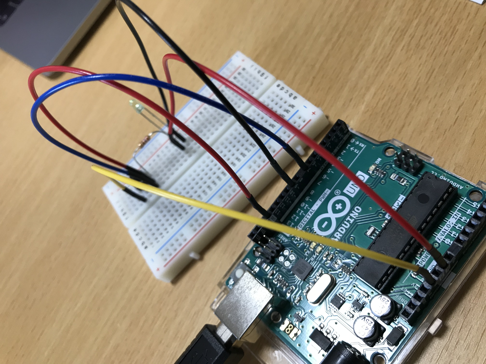
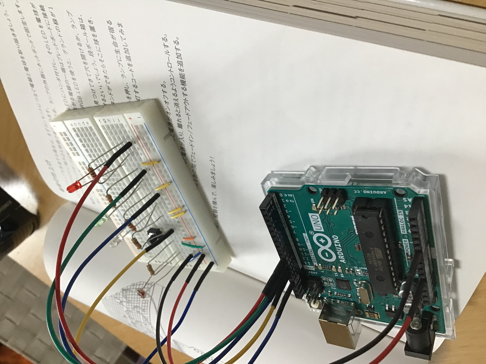

# Arduinoをはじめよう 
## ４章.LEDチカチカ

- HIGH/LOW, INPUT/OUTPUTの違いがややこしい。  
- 配線がわからんかった。マイコン側のジャンパワイヤのつなぐ場所とLEDの位置が大事。ブレッドボード側の原点は適当で良い。ただし、スイッチと抵抗とワイヤの相対位置は大切。  
- 今回使ったpush bottonはmomentary switchである。見た目的にalternate switchのイメージだった。
- switchを押している間、ずっとvalが更新し続けられ、手を離す瞬間までvalは更新し続けられる。我々にはそれが一刹那であってもArduinoは数千回もloopを繰り返している。
だから、スイッチを押しても思い通りにLEDのON/OFFを制御できない。
そこで、スイッチが押された時だけ認識したい。
valとold_valを用意し、スイッチが押される瞬間のみ、old_val = L, val = Hとなる。LLL…LLL -> HHH…HHH -> LLLLL…  となっていて、隣り合う２項間のパターンは「LL」「LH」「HL」「HH」
の４通り。


```c
const int LED = 13;
const int BUTTON = 7;

// 参考書ではval, old_valの初期値がLOWではなく０となっていた。
int val = LOW;
int old_val = LOW;
bool isOn = false;

void setup() {
  pinMode(LED, OUTPUT);
  pinMode(BUTTON, INPUT);
}

void loop() {
  val = digitalRead(BUTTON);

  // スイッチが押された瞬間を認識して、LEDのon/offを切り替える
  if (val == HIGH && old_val == LOW) {
    isOn = !isOn;
    delay(10);
  }
  old_val = val;

  if (isOn == true) {
    digitalWrite(LED, HIGH);
  }
  else {
    digitalWrite(LED, LOW);
  }
}

```

スイッチを押した瞬間の金属片のバウンシングがisOnを不安定にするので、これを解消するためにdelay(10)を入れる。  

    
## 5章. PWM  
  

・配線がまじで分からん。GND(写真では赤の線)をどこに接続するか。  
・プログラミングも理解に時間がかかった。その辺はコメントに残してわかりやすくした。  
・参考書に書いてある意味がわかりgndが2ついることに気づく。  
・しかし参考書通りにやっても思い通りいかない。諦めた。思い通りいかないおかげでいろいろ配線を変えまくって、案外適当にやってもLEDはつくことに気付いた。感電死の心配もないし、LEDとかも死なない。雑でオッケー。でもできない。fuck


```
const int LED = 9;
const int BUTTON = 7;

// 参考書ではval, old_valの初期値がLOWではなく０となっていた。
int val = 0;  //ボタンが押されているかいないか
int old_val = 0;
bool isOn = true;  //trueならLED点灯
int brightness = 128; //LEDの明るさ
unsigned long startTime = 0;  //いつ押し始めたか

void setup() {
  pinMode(LED, OUTPUT);
  pinMode(BUTTON, INPUT);
}

void loop() {
  val = digitalRead(BUTTON);

  /*スイッチが押された瞬間のみtrueとなり、LEDのon/offを切り替える。
    リセットされた瞬間を時刻０として、
    startTimeは押された瞬間の時刻が入る。
    millis()は現在の時刻が入る。
    よってmillis()-startTimeはスイッチを押してから何秒経過したかを表す。
  */

  if (val == HIGH && old_val == LOW) {
    isOn = !isOn;
    startTime = millis();
    delay(10);
  }

  if (val == HIGH && old_val == HIGH) {
    if (isOn == true && (millis() - startTime) > 500) {
      brightness++;
      delay(10);
      if (brightness > 255) {
        brightness = 0;
      }
    }
  }

  old_val = val;

  if (isOn == true) {
    analogWrite(LED, brightness);
  }
  else {
    analogWrite(LED, 0);
  }
}

```

その他シリアル通信も行った。実験してる感が出て嬉しかった。この辺でどう回路を組み立てれば良いか分かってきた。電流の流れを作るだけ。


## LEDランプ

  

急に本格的になり取っ付きにくい。Arduino側のスケッチは前章と変わらんが、Processing側は難しかった。  
難しい点；

-buffer 関係。そもそもどんな感じで読み込む？　C言語は１行１行と言う感じだった気がする。 buffer availableとかその辺分かりにくい。  
-parenthesisの引数はそれぞれ何を表しているか非常に分かりにくい。  
-全体の流れが掴めない。  
-下の関数が存在しないとprocessingに怒られる。そして諦める。

```c
if (chunk.index0f("love") >= 0 )  
          love++;  
if (chunk.index0f("peace") >= 0 )  
          peace++; 
if (chunk.index0f("arduino") >= 0)  
          arduino++; 
```
          
set up 内の frameRateとは？速い更新は必要ないって、更新速度はどんな感じで決める？

ボードの設計は大体わかった。+-のとこを急に使い出す。コンパクトにしないと幅が足りない。
ブレッドボードの中身が気になる。LEDのプラス側ってどこから供給されている？Degital input は電流を制御し(つまりプラス)、マイナスへと流れる。マイナスはCdsセルで繋いだGNDと繋がっている。  
抵抗って値をどう言う風に選べば良い？

processing側のスケッチ      

```
//import が何をimportするのか分かると良い。
import processing.serial.*;
import java.net.*;
import java.io.*;
import java.util.*;

//このリンクから読み込む
String feed = "https://blog.arduino.cc/feed/";

int interval = 5 * 60 * 1000;
int lastTime;
int love = 0;
int peace = 0;
int arduino = 0;
int light = 0;

Serial port;
color c;
String cs;

String buffer = "";
PFont font;

//setup（）の中身は、完成画面を見ると分かりやすい。size、frameRateなどが特にそう。
void setup() { 
  size(640, 480);
  frameRate(10);

  font = createFont("Helvetica", 24);
  fill(255);
  textFont(font, 32);

  String arduinoPort = Serial.list()[0];

  port = new Serial(this, arduinoPort, 9600);

  lastTime = millis();
  fetchData();
}


/*draw()も完成後の画面を見ると分かりやすい。Web APIの部分が理解しにくい。
port, serial, bufferのつく部分がそれに当たる。
それと、text, rectの関数も知らない。*/

void draw() {
  background(c);
  int n = (lastTime + interval - millis())/1000;

  c = color(peace, love, arduino);
  cs = "#" + hex(c, 6);

  text("Arduino Networked Lamp", 10, 40);
  text("Reading feed:", 10, 100);
  text(feed, 10, 140);

  text("Next update in "+ n + "seconds", 10, 450);
  text("peace", 10, 200);
  text(" " + peace, 130, 200);
  rect(200, 172, peace, 28);

  text("love", 10, 240);
  text(" " + love, 130, 240);
  rect(200, 212, love, 28);

  text("arduino", 10, 280);
  text(" " + arduino, 130, 280);
  rect(200, 252, arduino, 28);

  text("sending", 10, 340);
  text(cs, 200, 340);

  text("light level", 10, 380);
  rect(200, 352, light/10.23, 28);

  if (n <= 0) { 
    fetchData();
    lastTime = millis();
  }

  port.write(cs);

  if (port.available() > 0) {
    int inByte = port.read();
    if (inByte != 10) {
      buffer = buffer + char(inByte);
    } else {
      if (buffer.length() > 1) {
        buffer = buffer.substring(0, buffer.length() -1);
        light = int(buffer);
        buffer = "";
        port.clear();
      }
    }
  }
}


//fetchdataってSwift UIのCore Dataのところで出てきたやつ。読めるけどかけない。ulrとかその辺がどうなってるのか理解したい。

void fetchData() {
  String data;
  String chunk;

  love = 0;
  peace = 0;
  arduino = 0;
  try {
    URL url = new URL(feed);
    URLConnection conn = url.openConnection();
    conn.connect();

    BufferedReader in = new BufferedReader(
      new InputStreamReader(conn.getInputStream()));

    while ( (data = in.readLine ()) != null) {
      StringTokenizer st = new StringTokenizer(data, "\"<>,.()[] ");
      while (st.hasMoreTokens ()) {
        chunk = st.nextToken().toLowerCase();

// chunk.index0f does not exist
>        if (chunk.index0f("love") >= 0 )
>         love++;
>        if (chunk.index0f("peace") >= 0 )
>          peace++;
>        if (chunk.index0f("arduino") >= 0)
>          arduino++;
      }
    }
    if (peace > 64) peace = 64;
    if (love > 64) love = 64;
    if (arduino > 64) arduino = 64;

    peace = peace * 4;
    love = love * 4;
    arduino = arduino * 4;
  }
  catch (Exception ex) {
    ex.printStackTrace();
    System.out.println("ERROR: "+ex.getMessage());
  }
}
```


 Arduino側のスケッチ  

```
const int SENSOR = 0;
const int R_LED = 9;
const int G_LED = 10;
const int B_LED = 11;
const int BUTTON = 12;

int val = 0;
int btn = LOW;
int old_btn = LOW;
bool isOn = false;
char buffer[7];
int pointer = 0;
byte inByte = 0;

byte r = 0;
byte g = 0;
byte b = 0;

void setup() {
  Serial.begin(9600);
  pinMode(BUTTON, INPUT);
}

void loop() {
  val = analogRead(SENSOR);
  Serial.println(val);

  if ( Serial.available() > 0) {
    inByte = Serial.read();
  }

  if ( inByte == '#' ) {
    while ( pointer < 6 ) {
      buffer[pointer] = Serial.read();
      pointer++;
    }
    r = hex2dec(buffer[1]) + hex2dec(buffer[0]);
    g = hex2dec(buffer[3]) + hex2dec(buffer[2]);
    b = hex2dec(buffer[5]) + hex2dec(buffer[4]);

    pointer = 0;
  }

  btn = digitalRead(BUTTON);
  if ( (btn == HIGH) && (old_btn == LOW)) {
    isOn = !isOn;
  }

  old_btn = btn;

  if ( isOn == true ) {
    analogWrite(R_LED, r);
    analogWrite(G_LED, g);
    analogWrite(B_LED, b);
  }
  else {
    analogWrite(R_LED, 0);
    analogWrite(G_LED, 0);
    analogWrite(B_LED, 0);
  }
  delay(100);
}

int hex2dec(byte c) {
  if ( c >= '0' && c <= '9' ) {
    return c;
  }
  else if (c >= 'A' && c <= 'F' ) {
    return c - 'A' + 10;
  }
}
```
